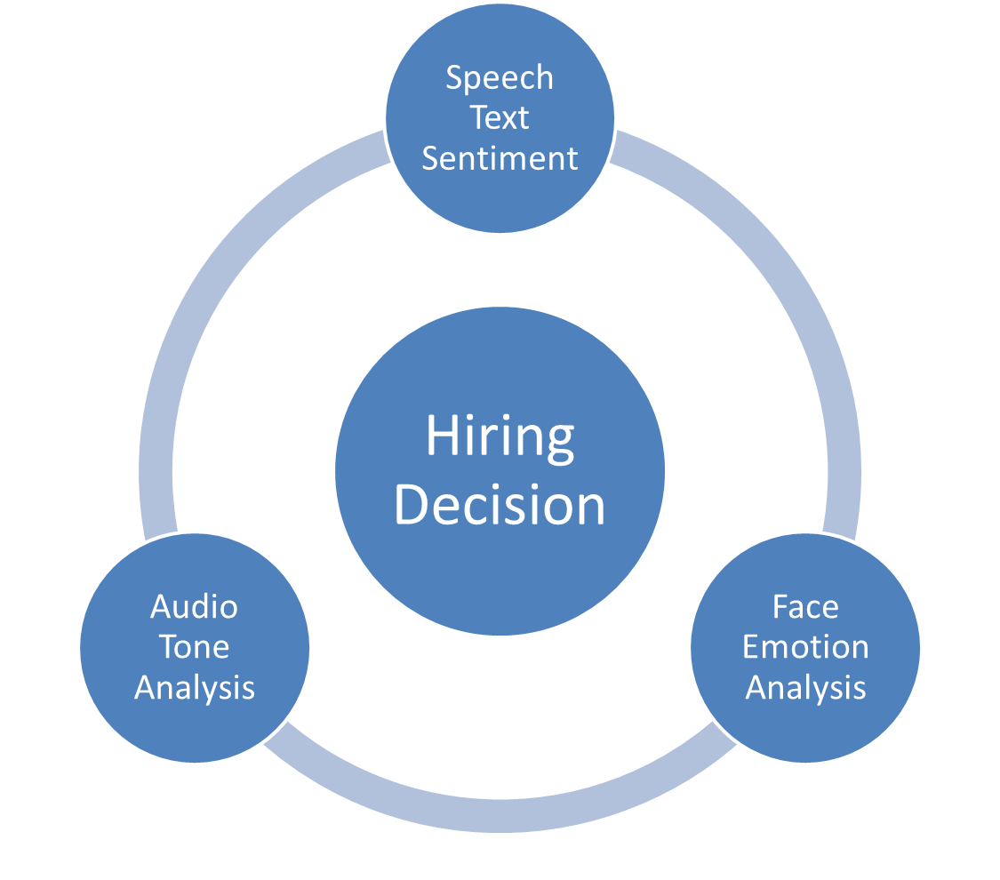

# Interview-Video-Analysis
Open Source Video Analysis of Video Interview round like Hirevue, Talview etc.

Hiring right candidates based on their videos

# Modules
<ul>
<li>Facial Emotion Analysis using keras model trained on FER 2013 data Kaggle</li>
<li>Audio Tone Analysis using paraat parselmouth library</li>
<li>Text Sentiment Analysis after removal of Stopwords using DeepAI Api</li>
</ul>

# Instructions for Execution
<ul>
<li>Clone Repository and to execcute you need to correct the path of files in project</li>
<li>Put Video file into Input</li>
<li>run main.py file after removal of already present audio files</li>
</ul>

# Scope of Improvements
<ul>
<li>Accuracy of Model may be improved more further</li>
<li>Scaling for more videos with beutiful web applicaiton</li>
</ul>

# Applications of this Project
<ul>
<li>Hiring companies could use this as another round before actaul interviews</li>
<li>Candidates could use it for practice of their Interview Skills</li>
</ul>

# Contributors
1. <a href = "https://github.com/harivilasp" >Hari Vilas Panjwani </a>
2. <a href = "https://github.com/ayush1920"> Ayush Kumar</a> 
