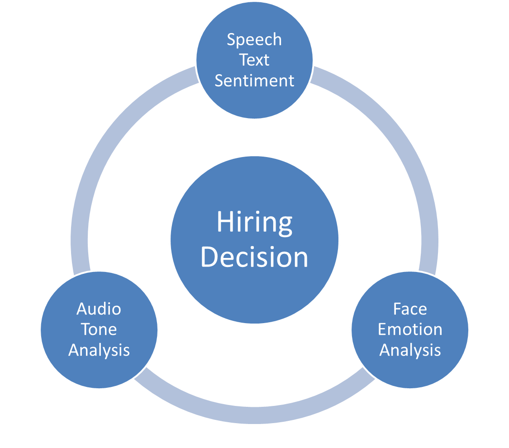

# Interview Video Analysis

[](https://github.com/harivilasp/Interview-Video-Analysis/stargazers)
[](https://github.com/harivilasp/Interview-Video-Analysis/network)
[](LICENSE)
[](https://deepwiki.com/harivilasp/Interview-Video-Analysis)

An open-source platform that automates video interview evaluation using computer vision, speech analysis, and NLP. Designed to help hiring companies screen candidates more objectively and help candidates practice and improve.



## What It Does

The system analyzes recorded video interviews across three dimensions:

| Signal | Method | Output |
|--------|--------|--------|
| **Facial emotions** | Keras CNN on FER-2013 | Frame-by-frame emotion distribution (happy, sad, angry, neutral, surprised) |
| **Speech patterns** | Parselmouth (Praat) | Words/min, pauses, filler words, tone variation |
| **Resume–JD fit** | NLTK + TF-IDF similarity | Relevance score between candidate resume and job description |

## Tech Stack

**Backend:** Python · Flask · OpenCV · Keras/TensorFlow · Parselmouth · NLTK · PyMongo

**Frontend:** React.js · Redux · React Router · Axios · WebRTC

**Database:** MongoDB

## Features

**For Companies**
- Post and manage job openings with descriptions
- Schedule video interviews with candidates
- View per-candidate analysis: emotion timeline, speech metrics, resume match score
- Review full interview recordings

**For Candidates**
- Browse and apply to open positions
- Join video interviews directly in the browser (WebRTC)
- Upload and manage resume
- Practice interview skills with recorded sessions

## Getting Started

### Prerequisites

- Python 3.7+
- Node.js 14+ and npm
- MongoDB (local or Atlas)
- FFmpeg

### Backend

```bash
git clone https://github.com/harivilasp/Interview-Video-Analysis.git
cd Interview-Video-Analysis/backend
pip install -r requirements.txt
python server.py
```

### Frontend

```bash
cd frontend
npm install
npm start
# Opens at http://localhost:3000
```

### Demo Credentials

| Role | Username | Password |
|------|----------|----------|
| Candidate | `hari_vilas` | `hari@123` |
| Company 1 | `company1` | `comp1@123` |
| Company 2 | `company2` | `comp2@123` |

## ML Models

**Emotion Detection** — Keras model trained on [FER-2013](https://www.kaggle.com/datasets/msambare/fer2013) (Kaggle). Classifies 7 emotions at inference time from OpenCV face crops.

**Speech Analysis** — [Parselmouth](https://parselmouth.readthedocs.io/) wraps Praat acoustics. Measures fundamental frequency, speaking rate, and pause distribution.

**Resume Matching** — TF-IDF vectorization with NLTK preprocessing (stopword removal, stemming). Cosine similarity between resume and job description embeddings.

## Roadmap

- [ ] Real-time feedback during live interviews
- [ ] Group interview support
- [ ] More sophisticated semantic resume matching (sentence transformers)
- [ ] Analytics dashboard with cross-candidate comparisons
- [ ] Docker Compose setup for one-command local deployment

## Contributors

- [Hari Vilas Panjwani](https://github.com/harivilasp)
- [Ayush Kumar](https://github.com/ayush1920)

## License

MIT License — see [LICENSE](LICENSE) for details.
